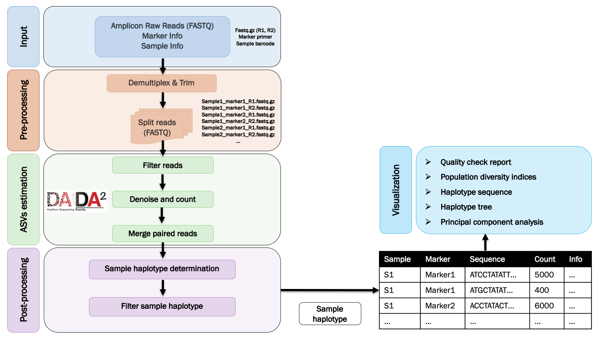

```{r setup, include=FALSE}
#knitr::opts_chunk$set(echo = TRUE,warning=FALSE)
knitr::opts_chunk$set(warning = FALSE, message = FALSE)
knitr::opts_knit$set(eval.after = 'fig.cap')
```

<style>
body {
text-align: justify}
</style>

---

## Introduction

**AmpseqR** is an R package for amplicon deep sequencing data analysis. The pipeline offers various useful steps including `Data pre-processing`, `Amplicon sequence variant (ASVs) estimation`, `Data post-processing`, and `Data visualization`. 

The `html report` include:

- Quality check report (`Data pre-processing`, `Amplicon sequence variant (ASVs) estimation`, `Data post-processing`)
- Haplotype sequence analysis

<br />



<br />

---

## Citation

> https://github.com/bahlolab/ampseqr

<br />

```{r,warning=FALSE,results='hide',include=FALSE,echo=FALSE}
library(tidyverse)
library(stringr)
library(readxl)
library(DECIPHER)
library(Biostrings)
library(ShortRead)
library(ggrepel)
library(plotly)
library(rlang)
library(future)
library(ggsci)
library(gtools)
library(hrbrthemes)
library(viridis)
library(flextable)
library(ggtree)
library(ggstance)
library(ampseqr)
library(rmarkdown)
library(magrittr)
library(ape)
library(pheatmap)
library(R3port)
library(htmltools)
library(cowplot)
library(data.table)
library(heatmaply)
library(randomcoloR)
```


```{css, echo = FALSE}
h1, #TOC>ul>li {
  color: #000000;
}

h2, #TOC>ul>li {
  color: #000000;
  font-weight: bold;
}

h3, #TOC>ul>ul>li {
  color: #1d4497;
  font-weight: bold;
}

h4, #TOC>ul>ul>li {
  color: #5773c0;
  font-weight: bold;
}


h5, #TOC>ul>ul>li {
  color: #7da7ea;
  font-weight: bold;
}


```

---

## Data

The data used to generate this report is output by AmpSeqR and includes: `sample_manifest`, `marker_info`, `demultiplexed`, `flt_reads`, `sub_reads`, `seq_ann_tbl`, `seq_flt_tbl`.


<br />

---

## Quality check

### Sample info

```
The dataset includes `r nrow(sample_manifest)` samples.
```

### Amplicon marker info

```
The dataset includes `r nrow(marker_info)` amplicon markers.
Marker names: `r stringr::str_c(marker_info$marker_id, collapse = ', ')`
```

### Overview of read counts

The pipeline provides an example to pull out how many reads were retained at various points of the pipeline (`Data pre-processing`, `Amplicon sequence variant (ASVs) estimation`, and `Data post-processing`). As a final check, this can track the number of reads through each step in the pipeline.

<br />

#### `Overview of read counts` {.tabset}

<br />

Filtering Steps | Description
---------|-------------
demultiplexed | Read count after demultiplexing
flt_reads | Read count after filtering the low quality score sequences
sub_reads | Down sampling per sample per amplicon data to certain number reads
seq_ann_tbl | Read count after calling amplicon sequence haplotype
seq_flt_tbl | Read counts after optimizing amplicon haplotype calling

<br />

##### Read counts table
The table represents the summary of the read counts at various filtering steps of the pipeline.

```{r}
#read_counts_tab(run)
read_counts_tab(demultiplexed,flt_reads,sub_reads,seq_ann_tbl,seq_flt_tbl)
```


<br />

##### Read counts plot
The figure represents the proportion of sequences that are final retained from `demultiplexed` to `seq_flt_tbl`.

```{r,fig.width=13,fig.height=2 + length(unique(demultiplexed$sample_id))/10}
#read_counts_plot(run)
read_counts_plot(demultiplexed,flt_reads,sub_reads,seq_ann_tbl,seq_flt_tbl)
  
```

<br />

```
Following we will look in more detail at how many reads were dropped at various points of the pipeline.
```

<br />

#### `Data pre-processing` {.tabset}

<br />

##### Entire dataset
The figure represents the summary of remained reads after demultiplexing by the amplicon marker.

```{r,fig.align='center'}
p <- demultiplexed %>% 
      filter(!(is.na(sample_id))) %>% 
      filter(!(is.na(marker_id))) %>% 
      ggplot(aes(marker_id, n, fill = marker_id)) +
      geom_boxplot() +
      ggtitle('Demultiplexing counts')+
      labs(y="Number of reads")+
      theme_light()
ggplotly(p)
```

<br />

##### Individual
The figure represents the remained reads per sample per marker after demultiplexing. 

```{r,fig.width=13,fig.height=2 + length(unique(demultiplexed$sample_id))/10}
p <- demultiplexed %>% 
      filter(!(is.na(sample_id))) %>% 
      filter(!(is.na(marker_id))) %>% 
      ggplot(aes(sample, n, fill = marker_id)) +
      geom_col() +
      coord_flip() +
      ggtitle('Demultiplexing counts')+
      facet_wrap(~marker_id,nrow = 1)+
      theme_light()+
      theme(
        legend.position = "none",
        axis.text.x = element_text(angle = 90)
      )
ggplotly(p)
```

<br />

##### Demultiplexed sequence counts table
The table represents the remained reads per sample per marker after demultiplexing. 

```{r}
demultiplexed %>% 
      filter(!(is.na(sample_id))) %>% 
      filter(!(is.na(marker_id))) %>% 
      select(sample_id,marker_id,n,sample,info) %>% 
      DT::datatable(
        extensions = 'Buttons',
    options = list(dom = 'Blfrtip',
                           buttons = c('csv', 'excel'),
                           lengthMenu = list(c(10,25,50,-1),
                                             c(10,25,50,"All")))
      )
```

<br />

#### `Filter and denoise reads` {.tabset}

<br />

##### Entire dataset
The figure represents the summary of remained reads after filtering the low quality score sequences by the amplicon marker.
**Fail** represents the failed reads.
**Pass** represents the reads that passed the filter step.

```{r}
p <- flt_reads %>% 
      mutate(fail = n_in - n_out, pass = n_out) %>% 
      select(sample_id, marker_id, pass, fail,sample) %>% 
      pivot_longer(c(pass, fail), names_to = 'status', values_to = 'n') %>% 
      ggplot(aes(marker_id, n, fill = status)) +
      geom_boxplot(aes(group=status)) +
      ggtitle('Read quality filtering')+
      labs(y="Number of reads")+
      theme_light()
ggplotly(p) %>%
  layout(boxmode = "group")
```

<br />

##### Individual
The figure represents the remained reads per sample per marker after filtering the low quality score sequences based on `dada2::filterAndTrim` function. 
**Fail** represents the failed reads.
**Pass** represents the reads that passed the filter step.

```{r,fig.width=13,fig.height=2 + length(unique(flt_reads$sample_id))/10}
p <-  flt_reads %>% 
      mutate(fail = n_in - n_out, pass = n_out) %>% 
      select(sample_id, marker_id, pass, fail,sample) %>% 
      pivot_longer(c(pass, fail), names_to = 'status', values_to = 'n') %>% 
      ggplot(aes(sample, n, fill = status)) +
      geom_col() +
      coord_flip() +
      facet_wrap(~ marker_id,nrow = 1,scales = "free_x") +
      ggtitle('Read quality filtering (DADA2)')+
      theme_light()+
      theme(
        axis.text.x = element_text(angle = 90)
      )
ggplotly(p)
```

<br />


##### Sequence counts table
The table represents reads went in (**n_in**) and how many reads made it out (**n_out**) after filtering the low quality score sequences. 

```{r,fig.align='center',fig.width=10,fig.height=8}
flt_reads %>% 
      mutate(fail = n_in - n_out) %>% 
      select(sample_id, marker_id, n_in, n_out, fail,sample,info) %>% 
      DT::datatable(
        extensions = 'Buttons',
    options = list(dom = 'Blfrtip',
                           buttons = c('csv', 'excel'),
                           lengthMenu = list(c(10,25,50,-1),
                                             c(10,25,50,"All")))
      )
```

<br />

#### `Amplicon sequence variant (ASVs) estimation` & `Data post-processing` {.tabset}

<br />

Here, we check how many reads were dropped at `Amplicon sequence variant (ASVs) estimation` & `Data post-processing` steps. 

`Amplicon sequence variant (ASVs) estimation` filters amplicon sequence haplotypes that are likely errors base on `dada2 sample inference algorithm`.

`Data post-processing` filters chimera sequences and maps amplicon sequence haplotypes to reference sequences to remove potentially erroneous amplicon sequence haplotypes and remove amplicon sequence haplotypes that do not meet thresholds (Parameters set before running AmpSeqR).


The amplicon sequence haplotype status:

Type | Description
---------|-------------
pass | Succeed: Read count that passed the filter step
low_sample_count | Failed: The sample read count lower than the minimum number of read per sample per marker
low_asv_count | Failed: The amplicon sequence haplotype count lower than the minimum number of read for each haplotype
low_asv_freq | Failed: The amplicon sequence haplotype frequency lower than the minimum haplotype frequency
low_ident | Failed: The amplicon sequence haplotype similarity (map to reference) lower than the minimum sequence similarity
low_ident_z | Failed: The standardized amplicon sequence haplotype similarity (map to reference) lower than the minimum standardized sequence similarity
chimera | Failed: The amplicon sequence haplotype is chimera reads
multiple | Failed: multiple fail types

<br />

##### Entire dataset
The figure represents the summary of passed reads and failed reads (different types) after `Amplicon sequence variant (ASVs) estimation` & `Data post-processing` steps.

```{r}
status_pal <-
    if (length(unique(seq_ann_tbl$status)) > 1) {
    seq_ann_tbl %>% 
    mutate(status = if_else(str_detect(status, ';'), 'multiple', status)) %>% 
    select(status) %>% 
    distinct() %>% 
    filter(status != 'pass') %>% 
    mutate(colour = scales::hue_pal()(n())) %>% 
    add_row(status = 'pass', colour = 'grey50') %>% 
    with(setNames(colour, status)) 
    } else {
    seq_ann_tbl %>% 
    mutate(status = if_else(str_detect(status, ';'), 'multiple', status)) %>% 
    select(status) %>% 
    distinct() %>% 
    mutate(colour = 'grey50') %>% 
    with(setNames(colour, status)) 
    }

p <- seq_ann_tbl %>% 
      mutate(status = if_else(str_detect(status, ';'), 'multiple', status)) %>% 
      ggplot(aes(status, count, fill = status)) +
      geom_boxplot(aes(group=status)) +
      scale_fill_manual(values = status_pal) +
      ggtitle('ASV status filtering')+
      facet_wrap(~marker_id,scale='free_x',shrink = FALSE)+
      coord_flip()+
      theme_light()+
      theme(
        axis.text.y = element_text(size=15)
      )
p
```

<br />

##### Individual
The figure represents the passed reads and failed reads (different types) per sample per marker after `Amplicon sequence variant (ASVs) estimation` & `Data post-processing` steps.  

```{r,fig.width=13,fig.height=2 + length(unique(seq_ann_tbl$sample_id))/10}
p <- seq_ann_tbl %>% 
      mutate(status = if_else(str_detect(status, ';'), 'multiple', status)) %>% 
      ggplot(aes(sample, count, fill = status)) +
      geom_col() +
      scale_fill_manual(values = status_pal) +
      coord_flip() +
      facet_wrap(~marker_id,nrow = 1,scales = "free_x") +
      ggtitle('ASV status filtering')+
      theme_light()+
      theme(
        axis.text.x = element_text(angle = 90)
      )
ggplotly(p)
```

<br />

##### Sequence counts table
The table represents the summary of the amplicon sequence haplotype status after `Amplicon sequence variant (ASVs) estimation` & `Data post-processing` steps.  

```{r}
seq_ann_tbl  %>% 
      select(sample_id, marker_id, count,status, ident, ident_z, sample,info) %>% 
      DT::datatable(
        extensions = 'Buttons',
    options = list(dom = 'Blfrtip',
                           buttons = c('csv', 'excel'),
                           lengthMenu = list(c(10,25,50,-1),
                                             c(10,25,50,"All")))
      )
```

<br />

### Missingness (Dataset) {.tabset}

<br />

#### Missingness
The figure represents missing values present in the dataset.

```{r,fig.align='center',fig.width=12,fig.height=7,echo=FALSE}
#miss_visual(run)
miss_visual(seq_flt_tbl,sample_manifest,marker_info)
```


<br />

#### Marker missingness
The table represents marker missingness in the dataset.

```{r,echo=FALSE}
#marker_miss(run)
marker_miss(seq_flt_tbl,sample_manifest,marker_info)

```

<br />

### Successful samples & markers {.tabset}

<br />

#### Successful

- A total of **`r length(unique(seq_flt_tbl$sample_id))`**/(of **`r length(sample_manifest$sample_id)`**) **Samples** remained for downstream analysis after filtering steps.

- A total of **`r length(unique(seq_flt_tbl$marker_id))`**/(of **`r length(marker_info$marker_id)`**) **Markers** remained for downstream analysis after filtering steps.

#### Failed sample

```{r,echo=FALSE}
failed <- data.frame(sample_id=setdiff(sample_manifest$sample_id,unique(seq_flt_tbl$sample_id)))
failed <- sample_manifest %>% 
  filter(sample_id %in% as.character(unique(failed$sample_id)))
failed %>% 
  DT::datatable(
        extensions = 'Buttons',
    options = list(dom = 'Blfrtip',
                           buttons = c('csv', 'excel'),
                           lengthMenu = list(c(10,25,50,-1),
                                             c(10,25,50,"All")))
      )
```


#### Failed marker

```{r,echo=FALSE}
failed_marker <- data.frame(marker_id=setdiff(marker_info$marker_id,unique(seq_flt_tbl$marker_id)))
failed_marker <- marker_info %>% 
  filter(marker_id %in% as.character(unique(failed_marker$marker_id)))
failed_marker %>% 
  DT::datatable(
        extensions = 'Buttons',
    options = list(dom = 'Blfrtip',
                           buttons = c('csv', 'excel'),
                           lengthMenu = list(c(10,25,50,-1),
                                             c(10,25,50,"All")))
      )
```


## {-}

<br />

---

## Haplotype analysis

### Read counts

The figure represents an overview of the read counts for amplicon markers of all samples in the dataset. 

```{r,fig.width=8 + length(unique(seq_flt_tbl$sample_id))/10,fig.height= 10+ length(unique(marker_info$marker_id))/10}
#hap_read_counts_plot(run)
hap_read_counts_plot(seq_flt_tbl)
```


<br />

### Within-sample diversity {.tabset}

<br />

The within-sample diversity by different amplicons. This is measured by the count of SNP-based haplotypes for all amplicons. 

<br />

#### The number of unique haplotypes per amplicon per sample
The figure represents the unique haplotypes detected for each amplicon each sample.

```{r,fig.align='center',warning=FALSE,message=FALSE,fig.width=8 + length(unique(seq_flt_tbl$sample_id))/10,fig.height= 8+ length(unique(marker_info$marker_id))/10}
unique_haplotypes_heatmap(seq_flt_tbl)


```

#### The average number of unique haplotypes
The figure represents the average number of unique haplotypes detected for each amplicon in the dataset.

```{r,warning=FALSE,message=FALSE,fig.width=10}
p <- seq_flt_tbl %>%
    group_by(sample,marker_id) %>%
    summarise(n=n()) %>%
    ungroup() %>%
  ggplot(aes(x=marker_id, y=n, fill=marker_id)) +
  geom_boxplot()+
    geom_point(color="black", size=0.4, alpha=0.5,position=position_jitter(w=0.3,h=0.1),shape = 21,aes(label=sample)) +
    theme_bw() +
    xlab("Amplicon Marker")+
    ylab("Number of distinct haplotypes")+
  theme(
    axis.text.x = element_text(size=16),
    axis.text.y = element_text(size=16),
    axis.title.x = element_text(size=17),
    axis.title.y = element_text(size=17),
    strip.text = element_text(size=17),
    legend.text = element_text(size=15),
    legend.title = element_text(size=16),
    legend.position = "none"
  )
ggplotly(p,tooltip = c("sample","n"))
```


<br />

### Haplotype diversity metrics of amplicon markers in dataset

<br />

Metrics | Description
---------|-------------
Haplotype | the unique haplotypes detected in dataset
He | expected heterozygosity
Size(bp) | the amplicon length
SNPs | the number of variable sites detected in dataset compared to the reference sequence 
Ave_hap | the average number of unique haplotypes detected for each amplicon in dataset

```{r,warning=FALSE,message=FALSE}
hapdiv_metrics(seq_flt_tbl,marker_info)
```

<br />

### Haplotype sequence {.tabset}

<br />

#### Haplotype sequence

The sequence represents the unique haplotype sequence detected for each amplicon in dataset. Labeled by **haplotype name (haplotype frequency%)**.

```{r,warning=FALSE,message=FALSE}
haplotype_sequence_vis(seq_flt_tbl,marker_info)
```

<br />

#### Haplotype sequence similarity 
The figure represents the distinct haplotypes & SNP positions for each amplicon in dataset. The X-axis represents the SNP position and the Y-axis represents the haplotype name. The **red** color indicates that the haplotype contains SNPs at certain positions compared to the reference sequence.

```{r,warning=FALSE,message=FALSE,fig.width=12,fig.keep='all'}
hap_seq_sim(seq_flt_tbl,marker_info)
```

<br />

### Haplotype tree {.tabset}

<br />

This haplotype tree is created by integrating all major haplotype sequences (>50%) in each sample and perform multiple sequence alignment based on `DECIPHER::AlignSeqs` function to identify the similarity between samples (`ape::nj`).

<br />

#### No imputation
The figure represents the haplotype tree, the amplicon markers represent the border color, the haplotype names represent the fill color (Due to there are a lot of haplotype names, colors of different markers may repeat).

```{r,fig.width=13,fig.height=2 + length(unique(seq_flt_tbl$sample))/10, warning=FALSE,message=FALSE}
hap_tree_plot(seq_flt_tbl)
```

<br />

#### Missing-data imputation
Since some samples are missing certain markers, the imputation are performed by replacing missing data within a variable by the mode (the most frequent value in each marker). The imputed values are colored in white.

```{r,fig.width=13,fig.height=2 + length(unique(seq_flt_tbl$sample))/10,warning=FALSE,message=FALSE}
hap_tree_plot_imputed(seq_flt_tbl)
```

### Principal component analysis(PCA) {.tabset}

<br />

Principal component analysis is performed by integrating all major haplotype sequences (>50%) in each sample and perform multiple sequence alignment based on `DECIPHER::AlignSeqs` function to identify and analysis sample genotypes.

<br />

#### No imputation

```{r,warning=FALSE,message=FALSE}
hap_pca(seq_flt_tbl)
```

<br />

#### Missing-data imputation
Since some samples are missing certain markers, the imputation are performed by replacing missing data within a variable by the mode (the most frequent value in each marker).

```{r,warning=FALSE,message=FALSE}
hap_pca_imputed(seq_flt_tbl)
```


<br />

