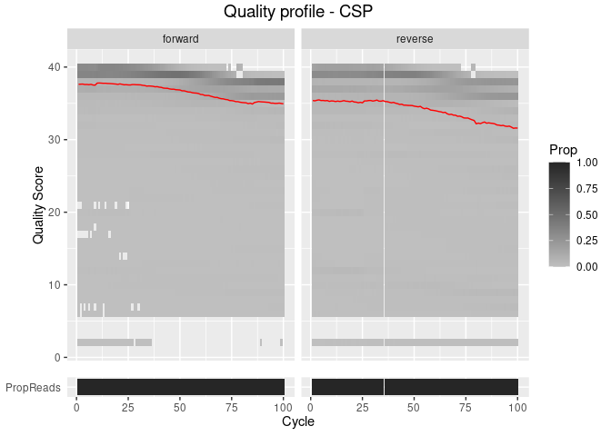

AmpSeqR Introduction
================
Jiru Han, Jacob E. Munro, Melanie Bahlo
2022-10-27

## `AmpSeqR`: an R package for amplicon deep sequencing studies

**AmpseqR** is an R package for analysis of amplicon deep sequencing
(AmpSeq) data generated on the Illumina platform. The pipeline offers
various useful functions including `Data pre-processing`,
`Amplicon sequence variant (ASVs) estimation`, `Data post-processing`,
and `Data visualization`. Additionally, AmpseqR includes several
parameters to filter noise reads and improve the accuracy of the
detected haplotype.

-   **Inputs** are the standard paired-end FASTQ format provided by the
    common Illumina sequencing platforms (e.g., MiSeq), as well as
    sample barcodes and target amplicon details.

-   **Outputs** are amplicon sequence variant (ASV) table, which records
    the number of times each exact amplicon sequence variant was
    observed in each sample. Additionally the pipeline will generate a
    summary report.

This document outlines the data format and key functions used by
`AmpSeqR` for processing amplicon deep sequencing data.

### Installation

`AmpSeqR` currently available to install from Github:

``` r
# install using devtools packages
if (!require(AmpSeqR)) {
  devtools::install_github("bahlolab/AmpSeqR")
}
```

### Key parameters in `AmpSeqR`

| Function         | Default | Description                                                                                                     |
|------------------|---------|-----------------------------------------------------------------------------------------------------------------|
| min_read_count   | 1000    | The minimum number of reads per sample per marker                                                               |
| min_marker_count | 100     | The minimum number of reads for each amplicon marker after calling haplotype                                    |
| n_sample         | 10000   | Downsamples an exact number of reads from paired-end fastq files                                                |
| min_overlap      | 10      | The minimum length of the overlap required for merging the forward and reverse reads                            |
| min_asv_count    | 5       | The minimum number of reads for each haplotype                                                                  |
| min_asv_freq     | 0.001   | The minimum haplotype frequency                                                                                 |
| min_ident        | 0.75    | The minimum sequence similarity                                                                                 |
| min_ident_z      | -3      | The minimum standardized sequence similarity                                                                    |
| max_breakpoints  | 3       | The maximum number of breakpoints chimera reads                                                                 |
| min_parent_ratio | 1.5     | The minimum ratio that the sequences greater than this value more abundant than a sequence can be its “parents” |
| max_marker_miss  | 0.5     | The maximum fraction of missing data for amplicon markers                                                       |
| max_sm_miss      | 0.5     | The maximum fraction of missing data for samples                                                                |
| min_homo_rep     | 3       | The minimum length of the homopolymer repeats                                                                   |
| sample_med_He    | 0       | The maximum median expected heterozygosity for the variance of all samples in the dataset                       |
| n_alleles        | 3       | The maximum number of alleles at a locus                                                                        |
| Var_MAF          | 0.001   | The minimum minor allele frequency of the variant                                                               |
| Var_He           | 0.001   | The minimum expected heterozygosity of the variant                                                              |

### Data Format

**Case study: The synthetic malaria parasite *Plasmodium falciparum*
dataset (3D7 and Dd2)**

The dataset consists of 5 *P. falciparum* samples with defined mixtures
(1:1, 1:10, 1:100, 1:500, 1:1000) of two *P. falciparum* reference
genomes Pf3D7 and PfDd2. We selected two amplicon markers, the *P.
falciparum* surface marker genes circumsporozoite protein (**CSP**) and
thrombospondin-related anonymous protein (*TRAP*).

``` r
library(AmpSeqR)
example_data <- get_ampseqr_example_data()
example_data$sample_manifest
```

    ## # A tibble: 5 × 5
    ##   sample_id barcode_fwd barcode_rev sample         info  
    ##   <chr>     <chr>       <chr>       <chr>          <chr> 
    ## 1 S01       ATCGCTAT    TCTAATGT    3D7_Dd2_1_1    1_1   
    ## 2 S02       GTGACGAA    TTACAGCA    3D7_Dd2_1_10   1_10  
    ## 3 S03       CTATTGCA    GTGCTAAT    3D7_Dd2_1_100  1_100 
    ## 4 S04       CGATCGAT    GCACTTGT    3D7_Dd2_1_500  1_500 
    ## 5 S05       AGAGGGAC    GCAAGCGT    3D7_Dd2_1_1000 1_1000

``` r
example_data$marker_info
```

    ## # A tibble: 2 × 7
    ##   marker_id primer_fwd                         prime…¹ seq   chrom  start    end
    ##   <chr>     <chr>                              <chr>   <chr> <chr>  <int>  <dbl>
    ## 1 CSP       GTGGAGTATGTCCGTAACTCAATGTCCGCCATG… CTAGCA… CCCA… Pf3D… 2.22e5 2.22e5
    ## 2 TRAP      CTTCTACGTCTTACAAAGGTTAGGTCAGCAATC… CGTGAT… TGGG… Pf3D… 1.47e6 1.47e6
    ## # … with abbreviated variable name ¹​primer_rev

-   The sample barcodes file should include sample_id, barcode_fwd,
    barcode_rev, sample (sample name, can be the same as sample_id),
    info (e.g., sample type).

-   The target amplicon detail file should include marker_id,
    primer_fwd, primer_rev, seq (reference sequence), chrom
    (chromosome), start (reference sequence start position), end
    (reference sequence end position).

These files should be set up in a text editor or excel and saved as text
CSV format (\*.csv) file.

### Run AmpSeqR

### Data pre-processing

The data pre-processing step demultiplexes the raw paired-end FASTQ
reads and trims the sample barcodes and target amplicon primer sequences
as well as assigning the sequence to each sample and marker (amplicon
target) combination.

``` r
# Data
reads_1 <- example_data$reads_1
reads_2 <- example_data$reads_2
sample_manifest <- example_data$sample_manifest
marker_info <- example_data$marker_info
# Create the analysis directory
dir.create("./runs")
run_dir <- "runs"
```

**Demultiplex reads**

Demultiplex the reads using the `demultiplex_reads` function as follows:

``` r
# Demultiplex reads
demultiplexed <- demultiplex_reads(sample_manifest = sample_manifest,
                                        marker_info = marker_info,
                                        reads_1 = reads_1,
                                        reads_2 = reads_2,
                                        output_dir = run_dir,
                                        output_sub_dir = file.path(run_dir, 'demultiplex')
                                   )
```

    ## note: 100000 of 100000 reads demultiplexed successfully.

``` r
demultiplexed
```

    ## # A tibble: 10 × 7
    ##    sample_id marker_id reads_1                        reads_2     n sample info 
    ##    <chr>     <chr>     <chr>                          <chr>   <int> <chr>  <chr>
    ##  1 S01       CSP       /stornext/Home/data/allstaff/… /storn… 10000 3D7_D… 1_1  
    ##  2 S01       TRAP      /stornext/Home/data/allstaff/… /storn… 10000 3D7_D… 1_1  
    ##  3 S02       CSP       /stornext/Home/data/allstaff/… /storn… 10000 3D7_D… 1_10 
    ##  4 S02       TRAP      /stornext/Home/data/allstaff/… /storn… 10000 3D7_D… 1_10 
    ##  5 S03       CSP       /stornext/Home/data/allstaff/… /storn… 10000 3D7_D… 1_100
    ##  6 S03       TRAP      /stornext/Home/data/allstaff/… /storn… 10000 3D7_D… 1_100
    ##  7 S04       CSP       /stornext/Home/data/allstaff/… /storn… 10000 3D7_D… 1_500
    ##  8 S04       TRAP      /stornext/Home/data/allstaff/… /storn… 10000 3D7_D… 1_500
    ##  9 S05       CSP       /stornext/Home/data/allstaff/… /storn… 10000 3D7_D… 1_10…
    ## 10 S05       TRAP      /stornext/Home/data/allstaff/… /storn… 10000 3D7_D… 1_10…

The main file outputs for the function `demultiplex_reads` are:

-   demultiplex folder: demultiplexed paired-end fastq files.
-   demultiplex.rds: the demultiplexed table in RDS format which
    includes sample_id, marker_id, reads_1 (the forward read fastq file
    path), reads_2 (the reverse read fastq file path), n (number of
    demultiplexed reads), sample, info.

**Visualize the quality profiles of the forward and reverse reads**

Before filtering and trimming the paired-end fastq files we can
visualize the quality profiles of the forward and reverse reads of
different amplicon markers by using the `plot_quality` function.

``` r
# Visualize the quality profiles of the forward and reverse reads
read_quality <- plot_quality(demultiplexed)
read_quality$CSP
```

<!-- -->

The red line shows the mean quality score of all samples in each cycle.
Color represents the proportion of reads of each quality score in each
cycle.

According to the quality profiles of the forward and reverse reads, we
can define the trim position for the forward and reverse reads to remove
low-quality bases. The marker_trim should be a data frame with three
columns marker_id (character), trim_fwd (integer), and trim_rev
(integer), or can be left unset (NULL).

**Filter and trim reads**

Filter the poor-quality reads and trim low-quality bases using the
`dada_filter` function as follows:

``` r
# Filter and trim reads
flt_reads <- demultiplexed %>% 
  dada_filter(output_dir = run_dir,
              output_sub_dir = file.path(run_dir, 'filter'))
flt_reads
```

    ## # A tibble: 10 × 9
    ##    sample_id marker_id     n sample         info   reads_1   reads_2  n_in n_out
    ##    <chr>     <chr>     <int> <chr>          <chr>  <chr>     <chr>   <dbl> <dbl>
    ##  1 S01       CSP       10000 3D7_Dd2_1_1    1_1    /stornex… /storn… 10000  4878
    ##  2 S01       TRAP      10000 3D7_Dd2_1_1    1_1    /stornex… /storn… 10000  4876
    ##  3 S02       CSP       10000 3D7_Dd2_1_10   1_10   /stornex… /storn… 10000  4874
    ##  4 S02       TRAP      10000 3D7_Dd2_1_10   1_10   /stornex… /storn… 10000  4869
    ##  5 S03       CSP       10000 3D7_Dd2_1_100  1_100  /stornex… /storn… 10000  4818
    ##  6 S03       TRAP      10000 3D7_Dd2_1_100  1_100  /stornex… /storn… 10000  4868
    ##  7 S04       CSP       10000 3D7_Dd2_1_500  1_500  /stornex… /storn… 10000  4935
    ##  8 S04       TRAP      10000 3D7_Dd2_1_500  1_500  /stornex… /storn… 10000  4933
    ##  9 S05       CSP       10000 3D7_Dd2_1_1000 1_1000 /stornex… /storn… 10000  4740
    ## 10 S05       TRAP      10000 3D7_Dd2_1_1000 1_1000 /stornex… /storn… 10000  4953

The main file outputs for the function `dada_filter` are:

-   filter folder: filtered and trimmed paired-end fastq files.
-   filtered_reads.rds table: the filtered table in RDS format which
    includes sample_id, marker_id, n (number of demultiplexed reads),
    sample, info, reads_1 (the filtered and trimmed forward fastq file
    path), reads_2 (the filtered and trimmed reverse fastq file path),
    n_in (number of reads before filtering and trimming), n_out (number
    of reads after filtering and trimming).

**Downsampling reads**

Downsampling reads using the `downsample_reads` function as follows:

``` r
# Downsampling reads
sub_reads <- flt_reads %>% 
  downsample_reads(output_dir = run_dir,
                   output_sub_dir = file.path(run_dir, 'downsample'),
                   min_read_count = 1000,
                   n_sample = 10000,
                   count_col = 'n_out') 
sub_reads
```

    ## # A tibble: 10 × 8
    ##    sample_id marker_id sample         info   reads_1         reads_2 n_out     n
    ##    <chr>     <chr>     <chr>          <chr>  <chr>           <chr>   <dbl> <dbl>
    ##  1 S01       CSP       3D7_Dd2_1_1    1_1    /stornext/Home… /storn…  4878  4878
    ##  2 S01       TRAP      3D7_Dd2_1_1    1_1    /stornext/Home… /storn…  4876  4876
    ##  3 S02       CSP       3D7_Dd2_1_10   1_10   /stornext/Home… /storn…  4874  4874
    ##  4 S02       TRAP      3D7_Dd2_1_10   1_10   /stornext/Home… /storn…  4869  4869
    ##  5 S03       CSP       3D7_Dd2_1_100  1_100  /stornext/Home… /storn…  4818  4818
    ##  6 S03       TRAP      3D7_Dd2_1_100  1_100  /stornext/Home… /storn…  4868  4868
    ##  7 S04       CSP       3D7_Dd2_1_500  1_500  /stornext/Home… /storn…  4935  4935
    ##  8 S04       TRAP      3D7_Dd2_1_500  1_500  /stornext/Home… /storn…  4933  4933
    ##  9 S05       CSP       3D7_Dd2_1_1000 1_1000 /stornext/Home… /storn…  4740  4740
    ## 10 S05       TRAP      3D7_Dd2_1_1000 1_1000 /stornext/Home… /storn…  4953  4953

The main file outputs for the function `downsample_reads` are:

-   downsample folder: downsampled paired-end fastq files with a read
    number greater than max_read_count.
-   subsampled_reads.rds table: the downsampled table in RDS format
    includes sample_id, marker_id, sample, info, reads_1 (the
    downsampled forward fastq file path), reads_2 (the downsampled
    reverse fastq file path), n_out (number of reads after filtering and
    trimming), n (number of reads after downsampling).

### Amplicon sequence variant (ASVs) estimation

The amplicon sequence variants (ASVs) estimation process identifies
amplicon haplotype sequences.

**Construct amplicon sequence variant table (ASV) table**

``` r
# Construct amplicon sequence variant table (ASV) table
seq_tbl <- sub_reads %>% 
  dada_seq_tbl(output_dir = run_dir) 
seq_tbl
```

    ## # A tibble: 19 × 7
    ##    sample_id marker_id sequence                        count status sample info 
    ##    <chr>     <chr>     <chr>                           <int> <chr>  <chr>  <chr>
    ##  1 S01       CSP       CCCAAATGCAAACCCAAATGCAAACCCAAA…  2481 pass   3D7_D… 1_1  
    ##  2 S01       CSP       CCCCAATGCAAACCCAAATGCAAACCCCAA…  2397 pass   3D7_D… 1_1  
    ##  3 S01       TRAP      TGGGTGAACCATGCAGTACCTCTAGCTATG…  2444 pass   3D7_D… 1_1  
    ##  4 S01       TRAP      TGGGTGAAGCATGCAGTACCTCTAGCTATG…  2432 pass   3D7_D… 1_1  
    ##  5 S02       CSP       CCCAAATGCAAACCCAAATGCAAACCCAAA…   496 pass   3D7_D… 1_10 
    ##  6 S02       CSP       CCCCAATGCAAACCCAAATGCAAACCCCAA…  4378 pass   3D7_D… 1_10 
    ##  7 S02       TRAP      TGGGTGAACCATGCAGTACCTCTAGCTATG…   495 pass   3D7_D… 1_10 
    ##  8 S02       TRAP      TGGGTGAAGCATGCAGTACCTCTAGCTATG…  4374 pass   3D7_D… 1_10 
    ##  9 S03       CSP       CCCAAATGCAAACCCAAATGCAAACCCAAA…    40 pass   3D7_D… 1_100
    ## 10 S03       CSP       CCCCAATGCAAACCCAAATGCAAACCCCAA…  4778 pass   3D7_D… 1_100
    ## 11 S03       TRAP      TGGGTGAACCATGCAGTACCTCTAGCTATG…    63 pass   3D7_D… 1_100
    ## 12 S03       TRAP      TGGGTGAAGCATGCAGTACCTCTAGCTATG…  4805 pass   3D7_D… 1_100
    ## 13 S04       CSP       CCCAAATGCAAACCCAAATGCAAACCCAAA…     9 pass   3D7_D… 1_500
    ## 14 S04       CSP       CCCCAATGCAAACCCAAATGCAAACCCCAA…  4926 pass   3D7_D… 1_500
    ## 15 S04       TRAP      TGGGTGAACCATGCAGTACCTCTAGCTATG…     8 pass   3D7_D… 1_500
    ## 16 S04       TRAP      TGGGTGAAGCATGCAGTACCTCTAGCTATG…  4925 pass   3D7_D… 1_500
    ## 17 S05       CSP       CCCCAATGCAAACCCAAATGCAAACCCCAA…  4737 pass   3D7_D… 1_10…
    ## 18 S05       TRAP      TGGGTGAACCATGCAGTACCTCTAGCTATG…     5 pass   3D7_D… 1_10…
    ## 19 S05       TRAP      TGGGTGAAGCATGCAGTACCTCTAGCTATG…  4948 pass   3D7_D… 1_10…

The main file outputs for the function `dada_seq_tbl` are:

-   seq_tbl.rds table: the seq_tbl table in RDS format includes
    sample_id, marker_id, sequence (haplotype sequence), count
    (haplotype read counts), status (haplotype status), sample, info.

### Data post-processing

This step primarily optimizes amplicon haplotype calling, such as indel
errors, chimeric reads and variant filtering.

Several parameters are used to filter haplotypes, such as:

-   haplotype frequency,
-   sequence similarity (haplotype sequences were mapped against
    reference sequences for each amplicon marker to calculate the
    sequence similarity),
-   variant heterozygosity,
-   minor allele frequency in a given dataset.

**Amplicon haplotype inference**

Haplotype inference using the `annotate_seq_tbl` function as follows:

``` r
# Haplotype inference
seq_ann_tbl <- seq_tbl %>% 
  annotate_seq_tbl(marker_info = marker_info,
                   output_dir = run_dir,
                   min_marker_count = 500,
                   min_asv_count = 5,
                   min_asv_freq = 0.001,
                   min_ident = 0.75,
                   min_ident_z = -3,
                   max_breakpoints = 3,
                   min_parent_ratio = 1.5
                   )
seq_ann_tbl
```

    ## # A tibble: 19 × 9
    ##    sample_id marker_id sequence          count status sample info  ident ident_z
    ##    <chr>     <chr>     <chr>             <int> <chr>  <chr>  <chr> <dbl>   <dbl>
    ##  1 S01       CSP       CCCAAATGCAAACCCA…  2481 pass   3D7_D… 1_1   1       1.05 
    ##  2 S01       CSP       CCCCAATGCAAACCCA…  2397 pass   3D7_D… 1_1   0.892  -0.843
    ##  3 S01       TRAP      TGGGTGAACCATGCAG…  2444 pass   3D7_D… 1_1   1       0.949
    ##  4 S01       TRAP      TGGGTGAAGCATGCAG…  2432 pass   3D7_D… 1_1   0.958  -0.949
    ##  5 S02       CSP       CCCAAATGCAAACCCA…   496 pass   3D7_D… 1_10  1       1.05 
    ##  6 S02       CSP       CCCCAATGCAAACCCA…  4378 pass   3D7_D… 1_10  0.892  -0.843
    ##  7 S02       TRAP      TGGGTGAACCATGCAG…   495 pass   3D7_D… 1_10  1       0.949
    ##  8 S02       TRAP      TGGGTGAAGCATGCAG…  4374 pass   3D7_D… 1_10  0.958  -0.949
    ##  9 S03       CSP       CCCAAATGCAAACCCA…    40 pass   3D7_D… 1_100 1       1.05 
    ## 10 S03       CSP       CCCCAATGCAAACCCA…  4778 pass   3D7_D… 1_100 0.892  -0.843
    ## 11 S03       TRAP      TGGGTGAACCATGCAG…    63 pass   3D7_D… 1_100 1       0.949
    ## 12 S03       TRAP      TGGGTGAAGCATGCAG…  4805 pass   3D7_D… 1_100 0.958  -0.949
    ## 13 S04       CSP       CCCAAATGCAAACCCA…     9 pass   3D7_D… 1_500 1       1.05 
    ## 14 S04       CSP       CCCCAATGCAAACCCA…  4926 pass   3D7_D… 1_500 0.892  -0.843
    ## 15 S04       TRAP      TGGGTGAACCATGCAG…     8 pass   3D7_D… 1_500 1       0.949
    ## 16 S04       TRAP      TGGGTGAAGCATGCAG…  4925 pass   3D7_D… 1_500 0.958  -0.949
    ## 17 S05       CSP       CCCCAATGCAAACCCA…  4737 pass   3D7_D… 1_10… 0.892  -0.843
    ## 18 S05       TRAP      TGGGTGAACCATGCAG…     5 pass   3D7_D… 1_10… 1       0.949
    ## 19 S05       TRAP      TGGGTGAAGCATGCAG…  4948 pass   3D7_D… 1_10… 0.958  -0.949

The main file outputs for the function `annotate_seq_tbl` are:

-   seq_ann_tbl.rds table: the annotate_seq_tbl table in RDS format
    includes sample_id, marker_id, sequence (haplotype sequence), count
    (haplotype read counts), status (haplotype status after annotation),
    sample, info, ident (sequence similarity), ident_z (standardized
    sequence similarity).

The amplicon sequence haplotype status includes various data types:

-   **pass**, a boolean variable that describes whether the read is
    considered as a valid haplotype sequence, having passed all quality
    control checks,
-   low_sample_count, **failed**: the sample read count lower than the
    minimum number of read per sample per marker,
-   low_asv_count, **failed**: the amplicon sequence haplotype count
    lower than the minimum number of read for each haplotype,
-   low_asv_freq, **failed**: the amplicon sequence haplotype frequency
    lower than the minimum haplotype frequency,
-   low_ident, **failed**: the amplicon sequence haplotype similarity
    (after being mapped to the reference) is lower than the minimum
    sequence similarity,
-   low_ident_z, **failed**: the standardized amplicon sequence
    haplotype similarity (map to reference) lower than the minimum
    standardized sequence similarity,
-   chimera, **failed**: the sequence is a chimera of reads,
-   multiple, **failed**: multiple fail types.

**Haplotype filtering**

Haplotype filtering using the `sequence_filter` function as follows:

``` r
# Haplotype filtering
seq_flt_tbl <- sequence_filter(
  seq_ann_tbl = seq_ann_tbl, 
  sample_manifest = sample_manifest,
  marker_info = marker_info, 
  output_dir = run_dir,
  vcf_output_dir = file.path(run_dir, 'vcf'), 
  min_homo_rep = 3,
  terminal_region_len = 1,
  max_sm_miss = 0.5, 
  max_marker_miss = 0.5, 
  sample_med_He = 0.1, 
  n_alleles = 3, 
  var_maf = 0.001, 
  var_he = 0.001
)
seq_flt_tbl
```

    ## # A tibble: 19 × 11
    ##    sample_id marker_id sequence count masked status ident haplo…¹ frequ…² sample
    ##    <chr>     <chr>     <chr>    <int> <lgl>  <chr>  <dbl> <chr>     <dbl> <chr> 
    ##  1 S01       CSP       CCCAAAT…  2481 FALSE  pass   1     CSP-2   0.509   3D7_D…
    ##  2 S01       CSP       CCCCAAT…  2397 FALSE  pass   0.892 CSP-1   0.491   3D7_D…
    ##  3 S01       TRAP      TGGGTGA…  2444 FALSE  pass   1     TRAP-1  0.501   3D7_D…
    ##  4 S01       TRAP      TGGGTGA…  2432 FALSE  pass   0.958 TRAP-2  0.499   3D7_D…
    ##  5 S02       CSP       CCCAAAT…   496 FALSE  pass   1     CSP-2   0.102   3D7_D…
    ##  6 S02       CSP       CCCCAAT…  4378 FALSE  pass   0.892 CSP-1   0.898   3D7_D…
    ##  7 S02       TRAP      TGGGTGA…   495 FALSE  pass   1     TRAP-1  0.102   3D7_D…
    ##  8 S02       TRAP      TGGGTGA…  4374 FALSE  pass   0.958 TRAP-2  0.898   3D7_D…
    ##  9 S03       CSP       CCCAAAT…    40 FALSE  pass   1     CSP-2   0.0083  3D7_D…
    ## 10 S03       CSP       CCCCAAT…  4778 FALSE  pass   0.892 CSP-1   0.992   3D7_D…
    ## 11 S03       TRAP      TGGGTGA…    63 FALSE  pass   1     TRAP-1  0.0129  3D7_D…
    ## 12 S03       TRAP      TGGGTGA…  4805 FALSE  pass   0.958 TRAP-2  0.987   3D7_D…
    ## 13 S04       CSP       CCCAAAT…     9 FALSE  pass   1     CSP-2   0.00182 3D7_D…
    ## 14 S04       CSP       CCCCAAT…  4926 FALSE  pass   0.892 CSP-1   0.998   3D7_D…
    ## 15 S04       TRAP      TGGGTGA…     8 FALSE  pass   1     TRAP-1  0.00162 3D7_D…
    ## 16 S04       TRAP      TGGGTGA…  4925 FALSE  pass   0.958 TRAP-2  0.998   3D7_D…
    ## 17 S05       CSP       CCCCAAT…  4737 FALSE  pass   0.892 CSP-1   1       3D7_D…
    ## 18 S05       TRAP      TGGGTGA…     5 FALSE  pass   1     TRAP-1  0.00101 3D7_D…
    ## 19 S05       TRAP      TGGGTGA…  4948 FALSE  pass   0.958 TRAP-2  0.999   3D7_D…
    ## # … with 1 more variable: info <chr>, and abbreviated variable names
    ## #   ¹​haplotype, ²​frequency
    ## # ℹ Use `colnames()` to see all variable names

The main file outputs for the function `sequence_filter` are:

-   the seq_flt_tbl.rds table: the final amplicon haplotype sequence
    table in RDS format which includes sample_id, marker_id, sequence
    (haplotype sequence), count (read counts), masked (TRUE indicates
    the sequence contains variants that might be errors, and replaces
    the nucleotide with the reference genome nucleotide), status
    (haplotype status, all pass), ident (sequence similarity), haplotype
    (a named panel of haplotypes for each marker), frequency
    (within-sample haplotype frequency for each marker), sample, info.

### Data visualization

The data visualization step generates a comprehensive Rmarkdown report
that contains various summary data visualizations and data summaries,
such as quality checks, performed at both the individual/sample and
amplicon level, amplicon haplotype sequence counts, haplotype diversity
metrics of amplicon markers in the dataset, haplotype sequence
visualization, haplotype tree generation, and principal component
analysis.

``` r
# Data visualization
generate_report(sample_manifest = sample_manifest,
                marker_info = marker_info, 
                demultiplexed = demultiplexed, 
                flt_reads = flt_reads, 
                sub_reads = sub_reads,
                seq_ann_tbl = seq_ann_tbl, 
                seq_flt_tbl = seq_flt_tbl, 
                report_output_dir = file.path(run_dir, 'report'))
```

The main file outputs for the function `generate_report` are:

-   the Report.html report: the HTML report including various summary
    data visualizations.

### Fast run

We also include the `process_run` function that calls all the functions,
making it easy to get all results.

``` r
# Data
reads_1 <- example_data$reads_1
reads_2 <- example_data$reads_2
sample_manifest <- example_data$sample_manifest
marker_info <- example_data$marker_info
# Create the analysis directory
process_run_dir <- "runs_process"
dir.create("./runs_process")
```

``` r
# Fast run
process_run(reads_1 = reads_1,
            reads_2 = reads_2,
            sample_manifest = sample_manifest,
            marker_info = marker_info,
            run_dir = process_run_dir,
            min_read_count = 1000,
            n_sample = 10000,
            min_marker_count = 500,
            min_asv_count = 5,
            min_asv_freq = 0.001,
            min_ident = 0.75,
            min_ident_z = -3,
            max_breakpoints = 3,
            min_parent_ratio = 1.5,
            min_homo_rep = 3,
            terminal_region_len = 1,
            max_sm_miss = 0.5, 
            max_marker_miss = 0.5, 
            sample_med_He = 0.1, 
            n_alleles = 3, 
            var_maf = 0.001, 
            var_he = 0.001
            )
```

### Citation

<https://github.com/bahlolab/AmpSeqR>
